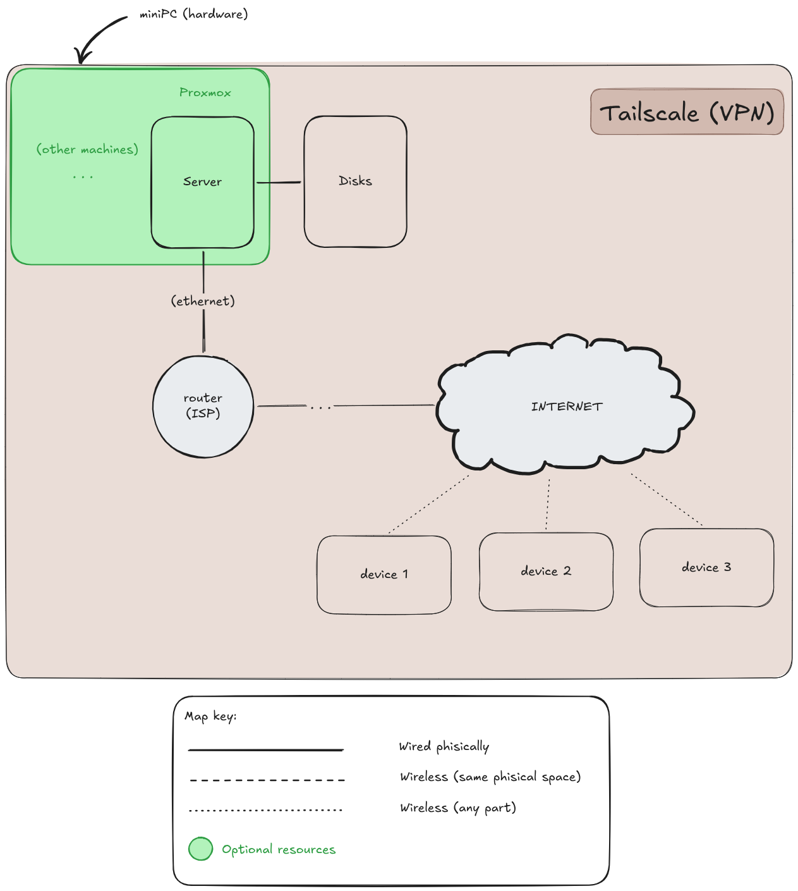

# HomeLab
A homelab is, in essential, a personal self-hosted IT environment. 

## Why?
My main motivation for the development of this project was a mix of wanting to learn and cursioty about
the deployment of servers and interconnecting all my devices.

## Features
Modularization: the principal idea was "I want to recreate this idea but ORGANIZED".
Documented: I usually forget almost everything so I want to recover the development where I stopped last time.

## Structure
Here is explained "the skeleton" of this HomeLab.

First, the components:
- Server: Central component where the information is being recieved and distributed. It's power on and functioning 24/7 so
          is recommended to buy some hardware not very demanding, for example a miniPC.
- Disks: Here we can use any form, internal or external, but here is used as a Docker Station with some HDD as a database.

> **_IMPORTANT:_**
> In this project the server is a Virtual Machine manage by the OS [Proxmox](https://www.proxmox.com/en/)

Second, we need to explain how is connected, and the best form is with an image:

